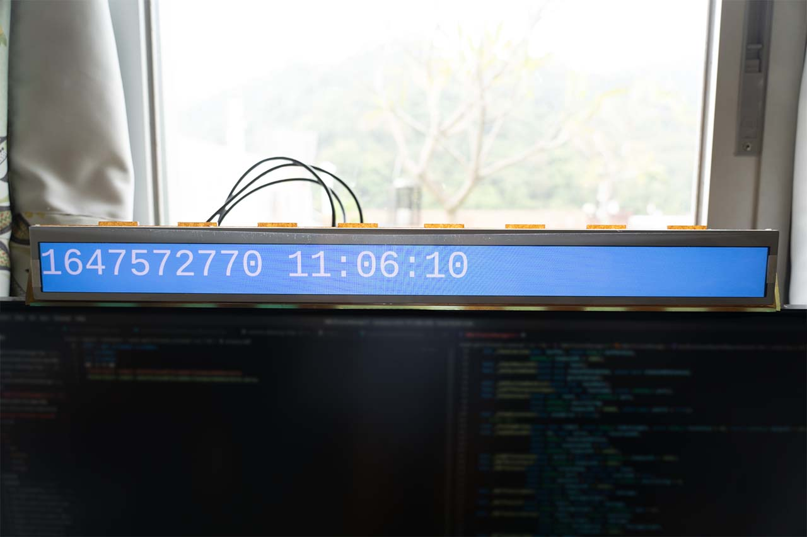
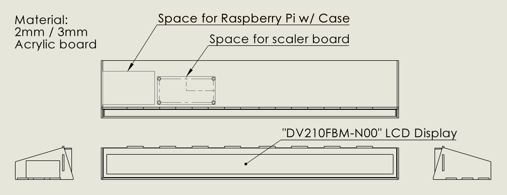

# Real life status bar - Design files and Code

<video src="c0004.webm" style="width: 100%;" autoplay loop alt="Nyan cat"></video>

### Hardware
"DV210FBM-N00.pdf" and "DV210FBM-N00.ai" contains a drawing of the 1920x132 display.

"status_bar_case.STEP" contains all acrylic pieces to assemble the case.

### Software

Clone this folder to "/srv/rlstatusbar".

Put "**xsession**" as "/home/pi/.xsession" on the Raspberry Pi. This file sets up scaling and a custom resolution for the 1920x132 display.

"**toilet.sh**" is a minimal text clock using the program "toilet". Run it inside a terminal.

"**terminal.py**" writes a braille wave to a text terminal, coded as "/dev/pts/0" inside the file.
 
First I tried pushing characters on the **Linux text console**. I cooked up a script that showed a colored wave on the screen. It end up rendering laggy at less than 10 FPS.

Then I tried writing to the framebuffer **/dev/fb0** directly. Some noise appeared in the output. 

I installed X server and set the Pi to auto run a full-screen graphics terminal **lxterminal** on startup. Result: same laggy display as the text console.

I ended up installing **Chromium** and making HTML pages. It is flawless at 60 FPS. I also verified WebGL performance with a "Lightning" demo found online. DOM manipulation is slow with Raspberry Pi though; the DOM-animated star backgrounds in "Nyan Cat" is laggy.

"**astroclock**", "**lightning**" and "**nc2**" are the completed themes mentioned below. The "autostart" file in each directory is the lxsession autorun script. The file is to be copied to "/home/pi/.config/lxsession/LXDE-pi/autostart".

**lightning** is a WebGL demo I found online.

**nc2** is nyan cat but using &#lt;canvas&#gt; instead of DOM animations.

**astroclock** is a better looking unix time clock. The background changes color with sunrise and sunset. The times are calculated with the "aa" program available in the package "astronomical-almanac". A local Python server "aa.py" serves the web page.

### Themes
#### Already done:
* Terminal (Text demo + Clock)
* Lightning "lightning" (WebGL demo) 
* Nyan Cat "nc2" (Web demo)
* Better looking clock "astroclock"

#### Backlog:
* GeoIP of my opponents when playing Mario Kart
* Stock ticker
* News roll
* Song title / Lyrics (Through Shazam or Bluetooth)
* You name it